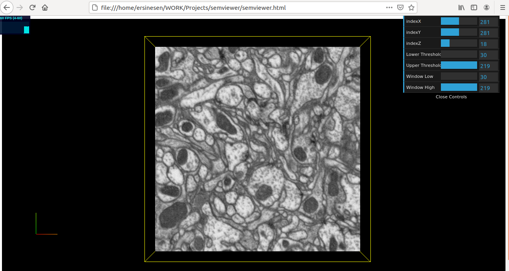

# semviewer: Scanning Electron Microscope Data Viewer

A three.js based web application that displays scanning electron microscope data in NRRD format. [Demo](https://semviewer-flq77dpaga-ue.a.run.app/)




## Run locally

* Unzip sample nrrd file

```
gunzip output.nrrd.gz
```

* Run a web server locally to serve output.nrrd file

```
#install (it requires nodejs/npm)
npm install http-server -g

#run
http-server -p 8080 --cors
```

* Open localviewer.html in a browser


## Run in Docker container

* Build container and run
```
docker build -t semviewer .
docker run -p 8080:8080 semviewer
```

* Open http://localhost:8080 in browser


## GCloud Deployment

```
gcloud auth login
gcloud builds submit --tag gcr.io/[PROJECTID]/semviewer
gcloud run deploy --image  gcr.io/[PROJECTID]/semviewer
```


## Notes

* To create nrrd file from a set of png files use ```png2nrrd.py```. Update datapath and correct the header as below.

* Sample NRRD header that Three.js can read

```
NRRD0004
# Complete NRRD file format specification at:
# http://teem.sourceforge.net/nrrd/format.html
type: short
dimension: 3
space: left-posterior-superior
sizes: 1000 1000 100
space directions: (0.93750000000000022,0,0) (0,-0.93750000000000022,0) (0,0,-1.5000000000000004)
kinds: domain domain domain
endian: little
encoding: ascii
space origin: (-119.53000000000002,119.53000000000007,84.000000000000028)
```

* Response size limit is 32MB in google cloud run. Hence nrrd file cant be served from container. 